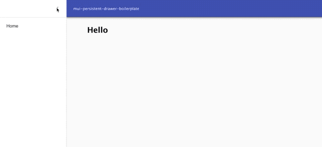

# mui-persistent-drawer-boilerplate
This is a simple express application that serves up a React page. 



In `App.jsx` there is an example of how to use the simple boilerplate components `Template` and `Container`.

```js
<Router history={history}>
          <div>
            <Route>
              <div>
                <Route
                  component={() => {
                    return (
                      <Template
                        open={this.state.open}
                        toggleDrawer={this.toggleDrawer}
                        navItems={menuItems}
                        history={history}
                      />
                    );
                  }}
                />
                <Container
                  open={this.state.open}
                >
                  <Route path="/" component={() => { return (<h1>Hello</h1>); }} />
                  {/*Enter More Routes here if you want them to shift with the AppBar when the menu is shown*/}
                </Container>
              </div>
            </Route>
          </div>
        </Router>
```

## Setup
To set up the project:

```
//Clone the Repository
git clone https://github.com/jagribble/mui-persistent-drawer-boilerplate.git
// Go into the folder
cd mui-persistent-drawer-boilerplate
// Install all the packages
npm install
// Run the project
npm start
```
